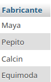
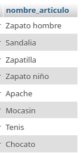

# bd_zapateria

# Sistema para una zapateria

## Modelo Entidad-Relacion

## Modelo físico de la BD

## Tabla fabricante

## Tabla Articulo

## Consultas a la BD

1. Mostrar la lista de todos los datos de los fabricantes

`SELECT * FROM Fabricante;`

2. Mostrar la lista de nombres de los Fabricantes, ponendo un alias al nombre de la columna

`SELECT nombre_fabricante AS Fabricante FROM Fabricante;`

3. Mostrar los nombres de los productos

4. Obtener los nombres y los precios de los productos de la tienda.

`SELECT nombre_articulo AS Nombre, precio_articulo AS Precio FROM Articulo;`

5. Obtener los nombres de los articulos cuyo precio sea superior 50000

`SELECT nombre_articulo FROM Articulo WHERE precio_articulo > 50000`

6. Obtener el nombre de los artículos cuyo precio esté entre 5000 y 40000 (ambos incluidos)

`SELECT nombre_articulo FROM Articulo WHERE precio Articulo WHERE precio_articulo >= 5000 AND precio_articulo <= 40000;

### Forma 2

`SELECT nombre_articulo FROM Articulo WHERE precio_articulo BETWEEN 5000 AND 40000;`

¡[Consulta 6](img/consulta_6.png "Consulta 6")

